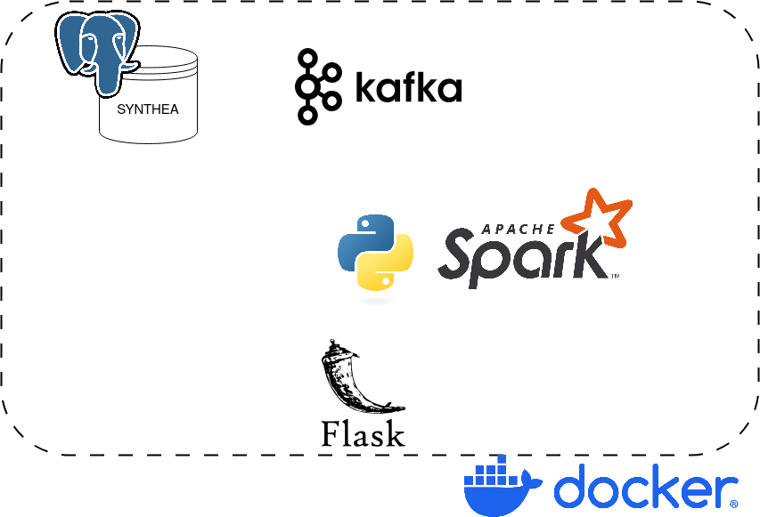

# ToDo RightNow


# Project Requirements
## Description 
Design and prototype a big data system to assist caregivers and healthcare providers in supporting the elderly. Collect data from wearable health monitors, smart home sensors (motion detection, fridge usage, etc.), and medical records. Leverage real-time analytics (Spark/Flink) to detect changes in daily routines or health indicators (e.g., sudden changes in heart rate or mobility), triggering alerts for potential emergencies. Use machine learning to predict risk of falls, hospital readmissions, or medication non-adherence.
## Suggested timeline
- Data Exploration & Design (Weeks 1–2)
   - [ ] Identify and acquire real or synthetic data (determine sources, volume, structure).
   - [ ] Define requirements (pipeline stages, potential data flow, big data tools to be used).

- Prototype & Infrastructure Setup (Weeks 3–5)
   - [ ] Set up and configure the chosen technologies (Spark, Kafka, databases, etc.).
   - [ ] Implement the initial data ingestion and storage components.
   - [ ] Validate the basic end-to-end flow with a small sample of data.

- Core Functionality & Analytics (Weeks 6–8)
   - [ ] Implement the main processing logic (batch or streaming) using Spark/Dask/Flink or a combination thereof.
   - [ ] If relevant, build the analytics or machine learning models on top of the processed data.

- Integration & Demo Preparation (Weeks 9–11)
   - [ ] Integrate all components into a single cohesive system (mind Docker).
   - [ ] Develop a real-time dashboard or a clear demonstration interface to show results.

- Refinement & Final Presentation (Weeks 12+)
   - [ ] Optimize or refine any pipeline components if time allows.
   - [ ] Prepare the 10-slide deck and codebase for submission.
   - [ ] Conduct a live demo (real-time, if applicable) during the oral exam.

# CARES (Caregiver Assistance and Remote Elderly Supervision)
Design and prototype a big data system to assist caregivers and healthcare providers in supporting the elderly. Collect data from wearable health monitors, smart home sensors (motion detection, fridge usage, etc.), and medical records.
## Abstract
XXX

## Technologies used
- **postgres**
- **Apache Kafka**
- **Spark**
- **Flask**



## Project Structure
XXX

## Setup & Configuration
XXX
### Configuration File
### Docker Setup
### How to Run
1. **Clean the environment**:
    ```sh
   docker-compose down --remove-orphans    
   ```
2. **Start Docker**:
    ```sh
    docker-compose up --build
    ```

Access the dashboard at `http://127.0.0.1:[OUR_PORT]`.

## Components Description
### UI
XXX
## Database
XXX
## Kafka
XXX
## Flask
XXX
## Spark
XXX

## Data Sources:
[Synthetic Patient Population Simulator](https://github.com/synthetichealth/synthea)
- Open-source tool simulating *virtual patient lifespans* (birth to death) using clinical guidelines. 
- Outputs structured data (FHIR, CSV) with demographics, diagnoses (ICD-10), meds (RxNorm), labs (LOINC), encounters, and social determinants.  
- Generates massive datasets (millions of synthetic patients) for ML/AI training (e.g., predictive models, EHR interoperability testing) without privacy constraints
- Customizable modules simulate diseases, regional trends, or rare conditions.  
- Use API or export scripts to stream FHIR/JSON data directly into pipelines (e.g., Kafka, Flink) or cloud platforms (AWS Kinesis, GCP Pub/Sub). Enables real-time analytics, synthetic EHR testing, or digital twin simulations.  
- Freely downloadable (GitHub)

[Smart Home Dataset](https://data.mendeley.com/datasets/zgsw84b2ff/1)
   - Description: 29 sensors are placed on carpets, doors, lights, bed, couch, fridge, oven, tv, and wardrobes. In addition to these sensors, the dataset also     
   contains the activity column that describes what activity (eat, sleep, work, personal, other, or anomaly) being simulated.
   Another column included in the dataset is the timestamps. This captures the time the sensor was activated and aggregated accordingly during the aggregation 
   phase of the simulation process.
   - CSV data containing binary and timestamp variables
   - Freely downloadable (Mendeley data)


### Authors
This project was created by group 13, consisting of:
 - Luca Frank - [@Luca-Frank](https://github.com/Luca-Frank)
 - Antonio - [@Mazza00](https://github.com/Mazza00)
 - Michele Brunelli - [@brunelliMichele](https://github.com/brunelliMichele)
 - Franco - [@Franco](https://github.com/)