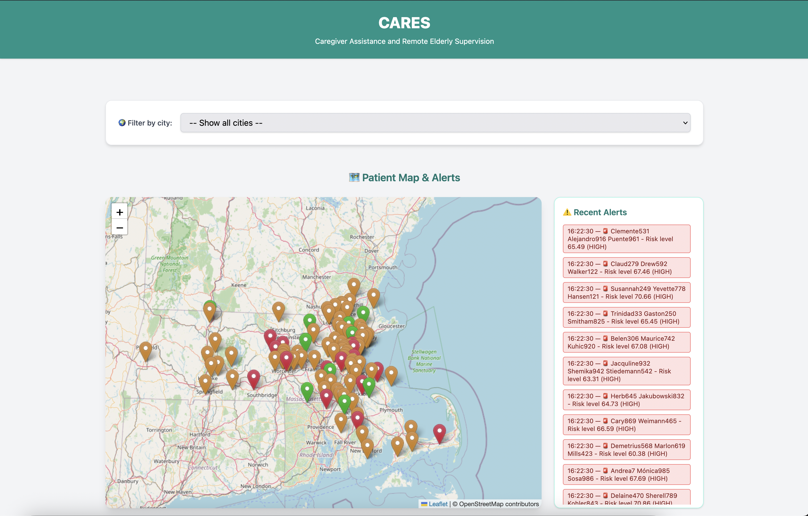
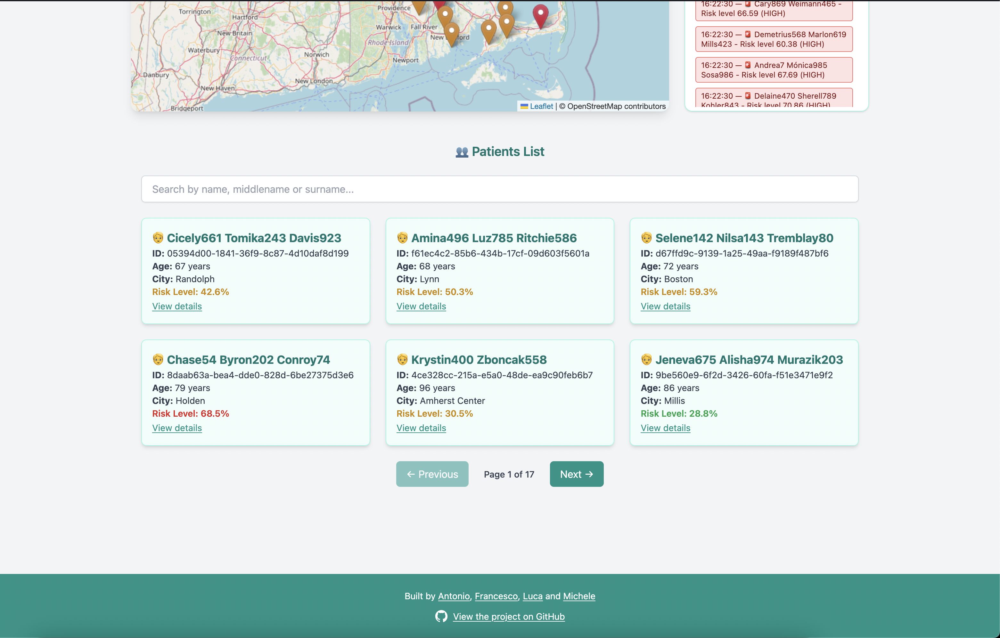
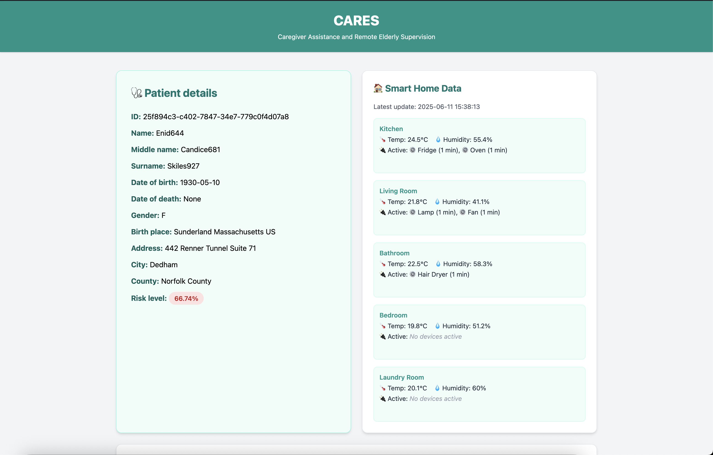
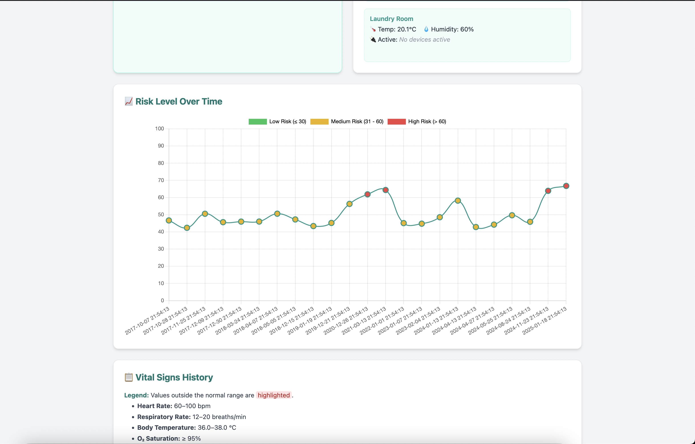
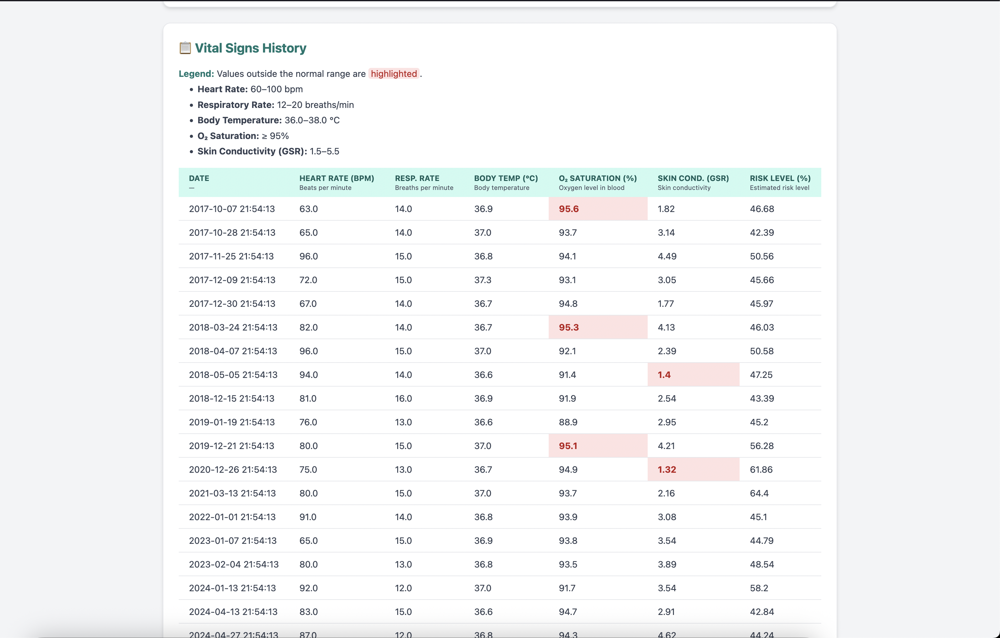

# CARES (Caregiver Assistance and Remote Elderly Supervision)

## Description 
This repository contains the Caregiver Assistance and Remote Elderly Supervision (CARES) System developed by group 13. The project aims to assist caregivers and healthcare providers in supporting the elderly, by collecting data from smart home sensors, medical records and wearable health monitors. Real-time analytics are constantly sift through LSTM model to detect changes in daily routines and health indicators, triggering alerts for potential emergencies. 

## Abstract
The system enables monitoring of environmental and vital parameters, ideally collected from sensors installed in the homes of elderly people (note on data collection below). The data flow passes through a multi-component pipeline, which processes real-time data, stores it in a relational database implemented in postgres, generates alerts, and makes them available through a Kafka pubisher/subscriber to web dashboard. A machine learning model is trained on the data generated at the start, which helps to evaluete the risk level for the healt of the patients starting from the real-time sensor data. All components are orchestrated using Docker Compose for easy deployment and testing.
Note on the data: unfortunately, we did not find a way to get meaningful real data from real patients, mainly because of privacy-related issues. Hence, we decided to generate the data ourself. At the start of the building of the containers, a bash script calls Synthea to generate an initial population of simulate patients and their history; we then use a set of functions to simulate in real time the collection of sensor data.

## Technologies used

- **PostgreSQL:** RDMS used to implement databases to store the raw and processed medical data and smart home sensors data;
- **Apache Kafka:** Used to implement publish/subscribe model, specifying the topic within the data pipeline and connecting the different components of the system;
- **Docker + Docker Compose:** Multiple containers singularly developed in Docker are orchestrated and managed together in Docker Compose;
- **Flask:** Python framework used to develop the backend and API for the User Interface. The subject can see in real-time the activities of sensors and the current and past clinical conditions of the elderly patient, along with potential alerts and the actual health risk;
- **WebSocket (via Flask-SocketIO):** Enables real-time communication between backend and frontend for immediate delivery of alerts and live sensor updates.
- **JavaScript (Vanilla JS, Chart.js, Leaflet):** Used to build a responsive frontend interface, visualize patient data over time (Chart.js), and display geographical information such as patient or alert locations (Leaflet);
- **Tailwind CSS:** Utility-first CSS framework used to design a clean, responsive, and customizable user interface for the dashboard and alert visualization.


## Project Structure

The repository is organized as follows:

```
.
├── docker-compose.yml
├── flask_app
│   ├── app.py
│   ├── config.py
│   ├── db.py
│   ├── Dockerfile
│   ├── requirements.txt
│   ├── routes.py
│   ├── sockets.py
│   ├── static
│   │   ├── css
│   │   │   └── style.css
│   │   ├── favicon.ico
│   │   └── js
│   │       ├── alerts.js
│   │       ├── main.js
│   │       ├── map.js
│   │       ├── patient_chart.js
│   │       ├── patient_main.js
│   │       ├── ui.js
│   │       └── utils.js
│   └── templates
│       ├── index.html
│       └── patient.html
├── kafka
│   ├── Dockerfile
│   ├── house_data.json
│   ├── requirements.txt
│   ├── risk_level_producer.py
│   └── smart_data_producer.py
├── ml_model
│   ├── Dockerfile
│   ├── entrypoint.sh
│   ├── requirements.txt
│   ├── train_loop.py
│   └── train_model.py
├── postgres
│   ├── Dockerfile
│   ├── incremental_patient_loader.py
│   ├── init
│   │   └── 01_init.sql
│   ├── initial_population.py
│   ├── requirements.txt
│   └── synthea-with-dependencies.jar
├── README.md
└── shared_modules
    └── process_patient_data.py
```

## Setup & Configuration

### Docker Setup

The project uses Docker to manage and run services. It includes a Docker Compose file docker-compose.yml which sets up PostgreSQL, Kafka, Flask and other servicies for generate and process the data. 

### 📦 Large File Support

This project uses [Git LFS](https://git-lfs.github.com/) for managing large files (e.g., model weights).

1. **Before cloning or pulling:**
    ```sh
    git lfs install
    ```
2. **If you already cloned the repo without LFS, run:**
    ```sh
    git lfs pull
    ```

### How to Run

1. **Start Docker:**
    ```sh
    docker-compose up --build [-d]
    ```
2. **Access to the dashboard:**
    Open a browser and go to `http://localhost:8000`.

3. **To restart the project:**
    Clean up with:
    ```sh
    docker-compose down -v --remove-orphans
    ```
    So rebuild and relaunch (1)

## Data Sources:
[Synthetic Patient Population Simulator](https://github.com/synthetichealth/synthea)
- Open-source tool simulating *virtual patient lifespans* (birth to death) using clinical guidelines. 
- Outputs structured data (FHIR, CSV) with demographics, diagnoses (ICD-10), meds (RxNorm), labs (LOINC), encounters, and social determinants.  
- Generates massive datasets (millions of synthetic patients) for ML/AI training (e.g., predictive models, EHR interoperability testing) without privacy constraints
- Customizable modules simulate diseases, regional trends, or rare conditions.  
- Use API or export scripts to stream FHIR/JSON data directly into pipelines (e.g., Kafka, Flink) or cloud platforms (AWS Kinesis, GCP Pub/Sub). Enables real-time analytics, synthetic EHR testing, or digital twin simulations.  
- Freely downloadable (GitHub)

## Components Description

### User Interface (UI) - FLASK

- **Files:**

  - **app.py:** Initializes the Flask application and sets up the Socket.IO server for real-time communication.

  - **routes.py:** Defines the HTTP routes and handles rendering of the main views such as the homepage and patient detail page.

  - **sockets.py:** Manages WebSocket communication with Kafka consumers, emitting real-time alerts and data updates to connected clients.

  - **db.py:** Provides helper functions to interact with the PostgreSQL database.

  - **config.py:** Stores configuration variables for database connections, Kafka topics, and other environment settings.

  - **templates/**
    - **index.html:** Main dashboard template displaying active patients, maps, and summary alerts.
    - **patient.html:** Detailed view of a specific patient’s health data, charts, and vital sign history.

  - **static/**
    - **css/**
      - **style.css:** Custom CSS for styling the frontend components with Tailwind CSS utility classes.

    - **js/**
      - **alert.js:** Handles rendering and state management of incoming alert banners and their interaction logic.
      - **main.js:** Controls main page behavior, including map loading and patient list updates.
      - **map.js:** Initializes and manages the Leaflet.js map displaying patient locations.
      - **patient_chart.js:** Renders time-series health data charts using Chart.js on the patient detail view.
      - **patient_main.js:** Controls interactions and data loading specific to the patient detail page.
      - **ui.js:** Utility functions for rendering UI components like modals, loaders, or notifications.
      - **utils.js:** Common helper functions used across multiple scripts.



*Figure 1: Dashboard home page showing map and alert notification history.*


*Figure 2: Dashboard home page with patient list.*


*Figure 3: Patient details page in the dashboard showing the selected patient details and the patient's smart home sensor data.*


*Figure 4: Patient details page in the dashboard showing the risk level graph of the selected patient.*


*Figure 5: Patient details page in the dashboard showing the vital signs table of the selected patient.*


## Database

- **Files:**

  - **initial_population.py:** Generates an initial set of synthetic patients (100) using Synthea, and loads the resulting CSV files into the PostgreSQL database.

  - **incremental_patient_loader.py:** Periodically generates new patients at fixed intervals and loads them into the database.

  - **synthea-with-dependencies.jar:** Java application used to simulate realistic synthetic patient data including demographics, conditions, encounters, and observations.

  - **init/**
    - **01_init.sql:** SQL script that initializes the PostgreSQL schema and creates all necessary tables for the project.

## Kafka

- **Files:**

  - **smart_data_producer.py:** Continuously generates smart home sensor data for every patient and publishes it to the `smart_home_data` Kafka topic for real-time UI updates.

  - **risk_level_producer.py:** Reads patient vital signs and associated risk levels from the database and publishes them to the `risk_alerts` Kafka topic, triggering alerts in the UI when necessary.

## ML Model

- **Files:**

  - **train_model.py:** Main script that processes patient observation data, trains a regression model to estimate patient health risk, and calculates individual risk levels for each patient. It stores both the trained model and scalers for future use, and inserts the resulting risk scores into the `vital_signs` table of the database.

  - **train_loop.py:** Script that repeatedly checks for new patient data at fixed intervals. If new patients are detected, it retrains the model to ensure predictions remain up-to-date.

  - **entrypoint.sh:** Shell script used to initialize the training container, it removes all the files in the output folder.

  - **process_patient_data.py:** Extracts and processes raw clinical observation data from the database, simulates missing features (e.g., body temperature, SpO2, GSR), and optionally applies a trained ML model to predict individual patient health risk scores. Returns a cleaned and enriched dataset ready for storage or further analysis.

## PostGres
- **Files:**
  - **incremental_patient_loader.py:** It periodically generates new patient data using Synthea. Then such data are loaded into a PostgreSQL database, and following vital signs and risk levels for each patient are calculated using a shared ML pipeline.
  - **initial_population.py:** Script to run Synthea for generating synthetic patient data and load it into a PostgreSQL database. Configured parameters are used to populate the following tables: patients, observations, and conditions


## Authors
This project was created by group 13, consisting of:
 - Luca Frank - [@Luca-Frank](https://github.com/Luca-Frank)
 - Antonio Mazzarello - [@Mazza00](https://github.com/Mazza00)
 - Michele Brunelli - [@brunelliMichele](https://github.com/brunelliMichele)
 - Francesco Danesi - [@FrancescoDanesi126](https://github.com/Francescodanesi126)
