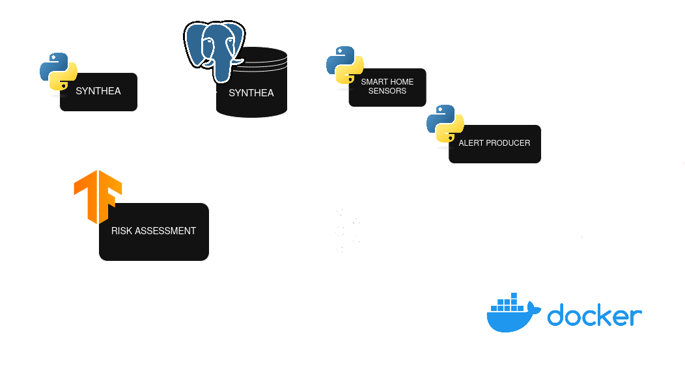
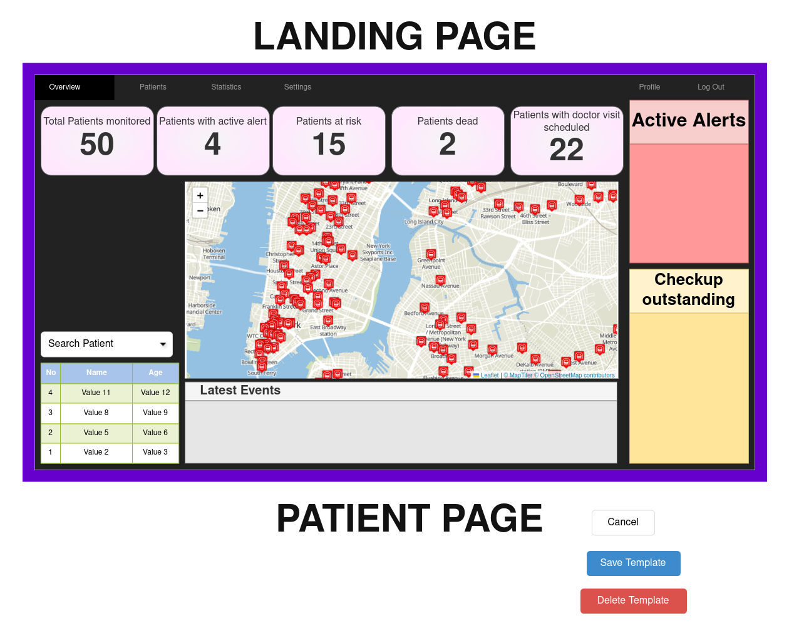

# ToDo RightNow


# Project Requirements
## Description 
This repository contains the Caregiver Assistance and Remote Elderly Supervision (CARES) System developed by group 13. The project aims to assist caregivers and healthcare providers in supporting the elderly, by collecting data from smart home sensors, medical records and wearable health monitors. Real-time analytics are constantly sift through LSTM model to detect changes in daily routines and health indicators, triggering alerts for potential emergencies. 
## Abstract
XXX

## Technologies used
- **PostgreSQL:** RDMS used to implement databases to store the raw and processed medical data and smart home sensors data;
- **Apache Kafka:** Used to implement publish/subscribe model, specifying the topic within the data pipeline and connecting the different components of the system;
- **Apache Spark:** Used to process real-time data and trigger potential alerts related to smart home sensors and/or medical conditions of patients;
- **Docker + Docker Compose:** Multiple containers singularly developed in Docker are orchestrated and managed together in Docker Compose
- **Flask:** Python framework used to develop User Interface. The subject can see in real-time the activities of sensors and the current and past clinical conditions of the elderly patient, along with potential alerts and the actual health risk.



## Project Structure
XXX

## Setup & Configuration
XXX
### Configuration File
### Docker Setup


### 📦 Large File Support

This project uses [Git LFS](https://git-lfs.github.com/) for managing large files (e.g., model weights).

**Before cloning or pulling:**
    ```sh
    git lfs install
    ```
    If you already cloned the repo without LFS, run:
    ```sh
    git lfs pull
    ```

### How to Run

1. **Start Docker:**
    ```sh
    docker-compose up --build [-d]
    ```
2. **Access to the dashboard:**
    Open a browser and go to `http://localhost:8000`.

3. **To restart the project:**
    Clean up with:
    ```sh
    docker-compose down -v --remove-orphans
    ```
    So rebuild and relaunch (1)


## Components Description
### UI


## Database
XXX
## Kafka
XXX
## Flask
XXX
## Spark
XXX

## Data Sources:
[Synthetic Patient Population Simulator](https://github.com/synthetichealth/synthea)
- Open-source tool simulating *virtual patient lifespans* (birth to death) using clinical guidelines. 
- Outputs structured data (FHIR, CSV) with demographics, diagnoses (ICD-10), meds (RxNorm), labs (LOINC), encounters, and social determinants.  
- Generates massive datasets (millions of synthetic patients) for ML/AI training (e.g., predictive models, EHR interoperability testing) without privacy constraints
- Customizable modules simulate diseases, regional trends, or rare conditions.  
- Use API or export scripts to stream FHIR/JSON data directly into pipelines (e.g., Kafka, Flink) or cloud platforms (AWS Kinesis, GCP Pub/Sub). Enables real-time analytics, synthetic EHR testing, or digital twin simulations.  
- Freely downloadable (GitHub)


### Authors
This project was created by group 13, consisting of:
 - Luca Frank - [@Luca-Frank](https://github.com/Luca-Frank)
 - Antonio Mazzarello - [@Mazza00](https://github.com/Mazza00)
 - Michele Brunelli - [@brunelliMichele](https://github.com/brunelliMichele)
 - Francesco Danesi - [@FrancescoDanesi126](https://github.com/Francescodanesi126)
